# SNISTPMS(SNIST PRESENTATION MANAGEMENT SYSTEM)
It is a prototype app for my college where all the subjects pdf and ppts are stored in the cloud and users can access them by searching the subject names and they can add those subjects after searching to their favourites to easily access those particular subjects material than searching everytime,users can download,view those materials from that app if its a pdf they can view from drive pdfviewer or else the app will take them to a WebView.

#SCREEN SHOTS

<table>
  <tr>
    <td>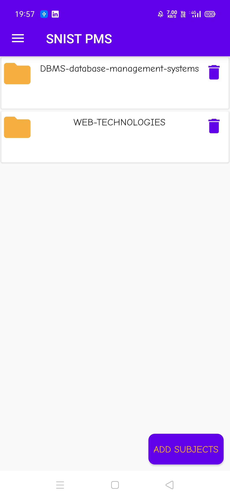</td>
    <td>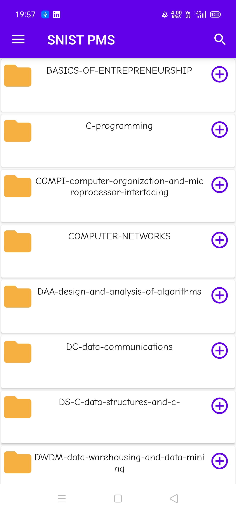</td>
  </tr>
  <tr>
    <td>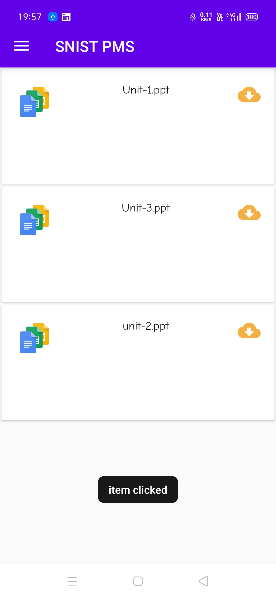</td>
    <td>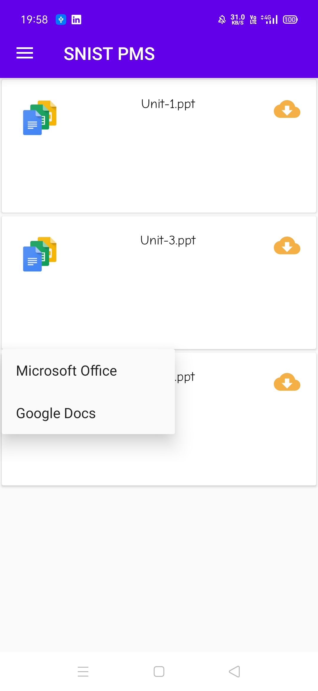</td>
  </tr>
<tr>
    <td>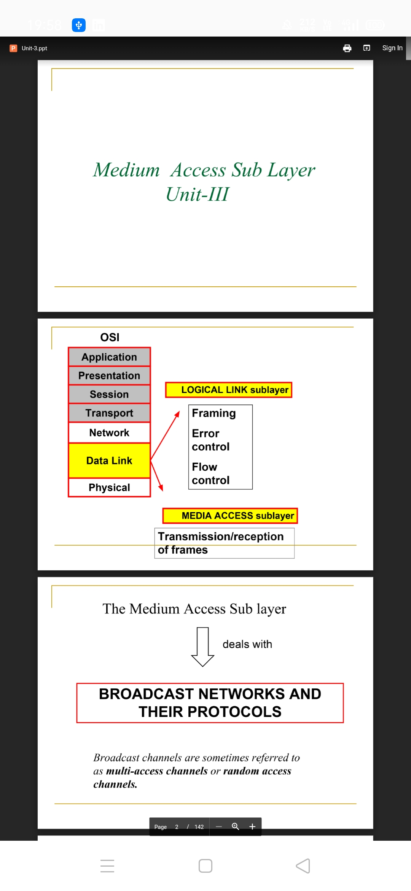</td>
    <td>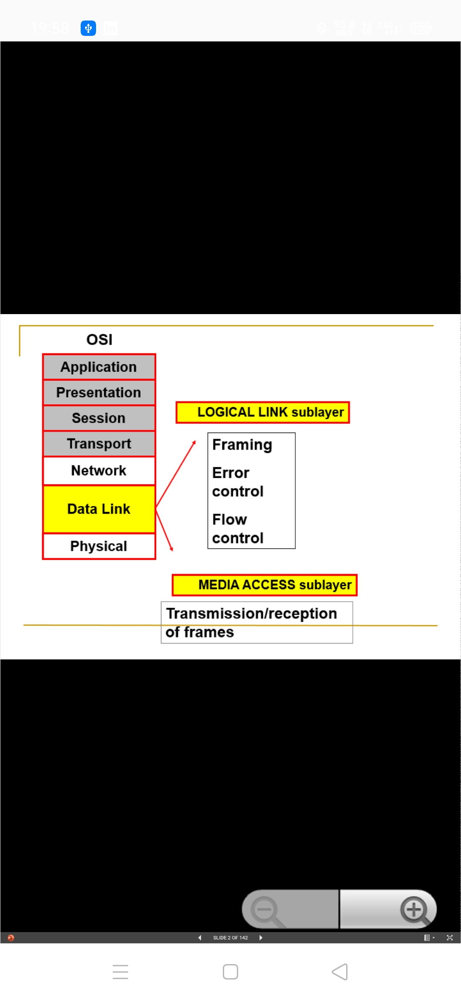</td>
  </tr>
<tr>
    <td>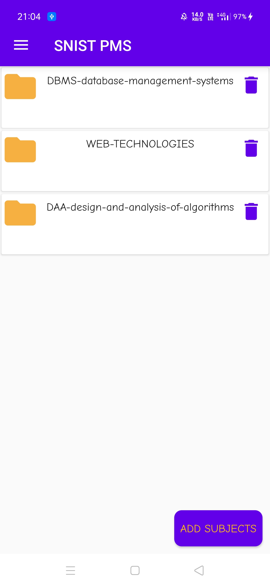</td>
    <td>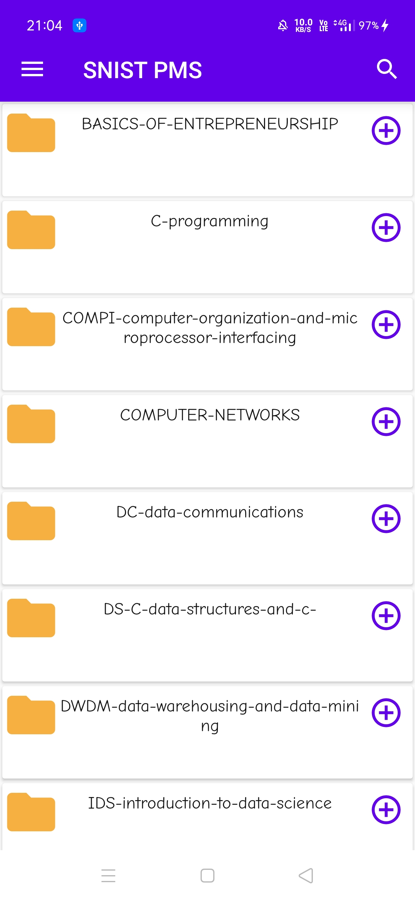</td>
  </tr>
<tr>
    <td>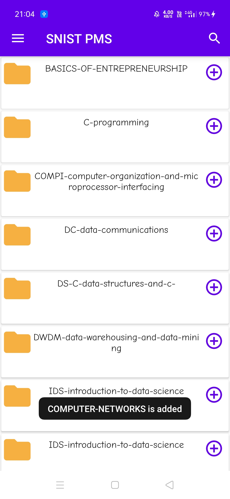</td>
    <td>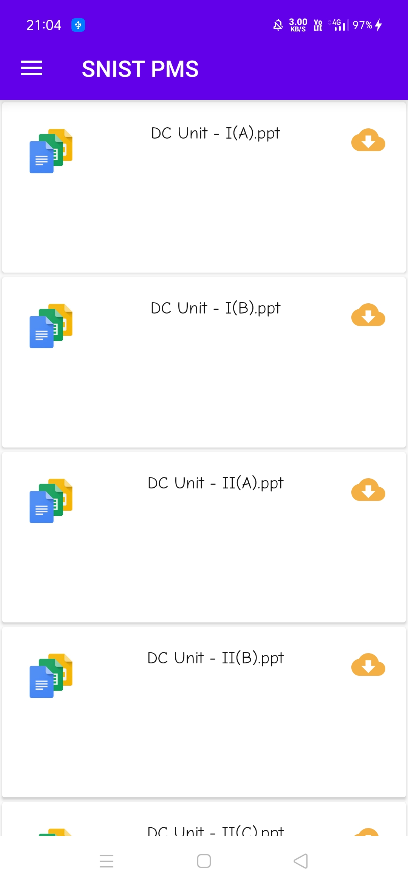</td>
  </tr>
<tr>
    <td>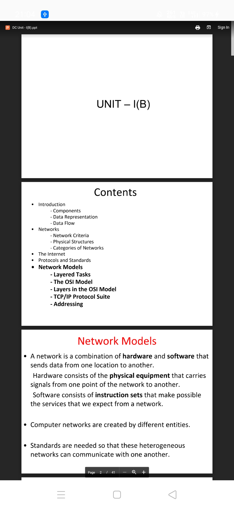</td>
    <td>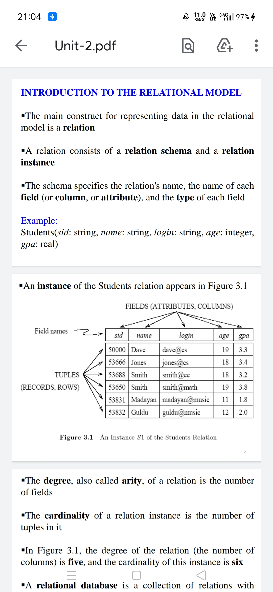</td>
  </tr>
   
 </table>
